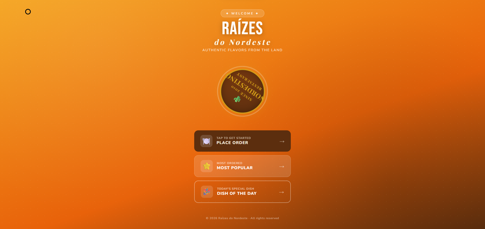
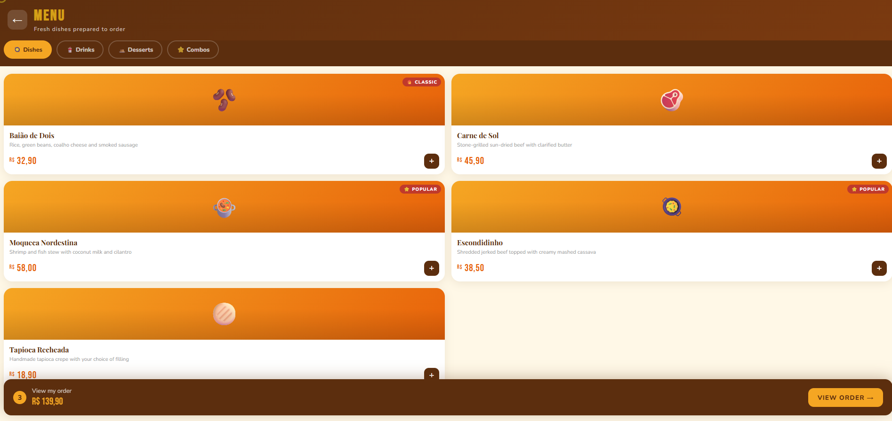
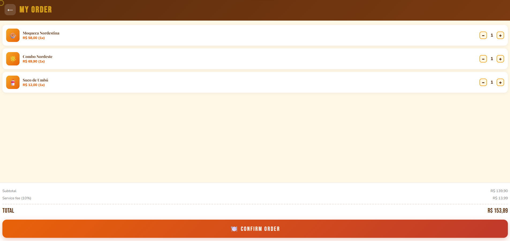
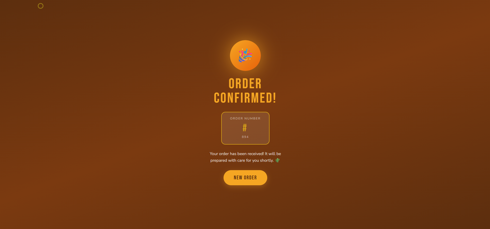

# 🌵 Raízes do Nordeste — Self-Service Kiosk

> Front-end prototype of a self-service ordering kiosk developed for the Raízes do Nordeste restaurant chain.
> Built using HTML5, CSS3 and JavaScript (ES6+) without frameworks.

---

## 📸 Preview

| Home                      | Menu                      |
| ------------------------- | ------------------------- |
|  |  |

| Cart                      | Order Confirmed                  |
| ------------------------- | -------------------------------- |
|  |  |

---

## 📋 About the Project

This project was developed for the **Multidisciplinary Project** at **UNINTER**, based on a case study involving the Raízes do Nordeste restaurant chain.

The objective was to design and implement the front-end of a self-service kiosk that allows customers to browse the menu, add products to a cart, review their order and receive a confirmation number.

### User Journey

```text
Home → Menu → Cart → Order Confirmation
```

---

## ✨ Features

* 🍽️ Dynamic menu rendering
* 🔍 Category filtering
* ⭐ Popular dishes section
* 🌟 Daily special highlight
* 🛒 Floating shopping cart
* ➕➖ Quantity controls
* 💰 Automatic total calculation
* 🎉 Order confirmation with generated order number
* 🖱️ Custom cursor effects
* 📱 Responsive design

---

## 🗂️ Project Structure

```text
📁 ProjetRaizes/
│
├── index.html
├── style.css
├── app.js
├── README.md
│
└── img/
    ├── 1.png
    ├── 2.png
    ├── 3.png
    └── 4.png
```

| File       | Purpose                                        |
| ---------- | ---------------------------------------------- |
| index.html | Application structure and screens              |
| style.css  | Styling, animations and responsive layout      |
| app.js     | Menu rendering, cart management and navigation |
| img/       | Application screenshots                        |

---

## 🧠 Technical Overview

### Menu Data

The menu is stored as an array of JavaScript objects:

```javascript
{
  id: 3,
  name: "Moqueca Nordestina",
  price: 58.00,
  cat: "pratos",
  badge: "⭐ Popular"
}
```

### Dynamic Rendering

Menu items are generated dynamically through JavaScript using:

```javascript
.map()
.join('')
```

No menu cards are hardcoded in HTML.

### Cart Structure

The cart uses an object where:

```javascript
{
  3: 2,
  11: 1
}
```

Meaning:

* Dish ID 3 → quantity 2
* Dish ID 11 → quantity 1

This provides quick access and prevents duplicate entries.

---

## 🚀 Running the Project

Clone the repository:

```bash
git clone https://github.com/wall966/ProjetRaizesNordeste.git
```

Open the project folder and launch:

```bash
index.html
```

No installation or dependencies are required.

---

## 🛠️ Technologies Used

* HTML5
* CSS3
* JavaScript (ES6+)
* Google Fonts
* Whimsical (Wireframing)

---

## 📐 Wireframes

Wireframes were designed before implementation using Whimsical.

🔗 https://whimsical.com/wallace-s-workspace157/UTWK2iZa31xYA4BMuA3QqL

---

## 📚 Academic Information

| Item        | Details                           |
| ----------- | --------------------------------- |
| Institution | UNINTER                           |
| Course      | Systems Analysis and Development  |
| Subject     | Multidisciplinary Project         |
| Track       | Front-End Development             |
| Year        | 2026                              |
| Student     | Nogueira Wallace                  |


---

## 🔮 Future Improvements

* Back-end integration
* Database support
* Online payments
* Customer authentication
* Loyalty program
* Administrative dashboard
* Real-time order tracking

---

## 📄 License

Academic project developed for educational purposes at UNINTER.

© 2026 Nogueira WAllace
